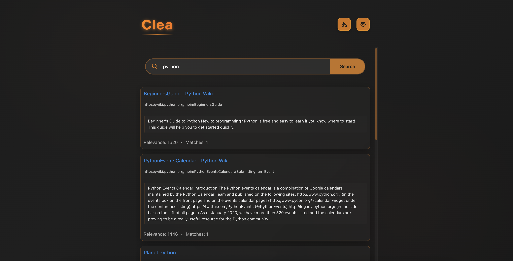

# Clea: A Search Engine


Clea is a modern, self-hosted search engine with web crawling capabilities, designed to provide personalized search functionality across websites you care about. With a sleek, modern UI and powerful backend, Clea makes discovering and organizing web content easy.



## Features

- **Powerful Web Crawling**: Automatically discovers and indexes content from specified websites
- **Custom Site Management**: Add, remove, and manage sites to be crawled and indexed
- **Intelligent Search**: Finds relevant results based on content matching and relevance scoring
- **Modern UI**: Clean, responsive interface built with React and Mantine UI components
- **Full-Text Search**: Indexes and searches use the full-text searching
- **Robots.txt Compliance**: Respects website crawling directives
- **Customizable Indexing**: Control how many pages are crawled per site

## Architecture

Clea is built using a modern tech stack:

### Backend
- **Flask**: Lightweight Python web framework
- **SQLite**: Database for storing indexed content and site information
- **BeautifulSoup**: HTML parsing and content extraction
- **NLTK**: Natural language processing for better search results

### Frontend
- **React**: Modern UI library
- **Mantine UI**: Component library for consistent styling
- **Framer Motion**: Animation library for smooth transitions
- **Vite**: Fast build tool and development server

## Getting Started

### Prerequisites

- Python 3.9+
- Node.js 18+
- NLTK data files

### Installation

1. Clone the repository:
   ```bash
   git clone https://github.com/dsameendra/clea.git
   cd clea
   ```

2. Install Python dependencies:
   ```bash
   pip install -r requirements.txt
   ```

3. Set up NLTK data (for natural language processing):
   ```python
   import nltk
   nltk.download('stopwords')
   nltk.download('punkt')
   ```

4. Initialize the database:
   ```bash
   python init_db.py
   ```

5. Install frontend dependencies:
   ```bash
   cd frontend
   npm install
   ```

### Running Clea

1. Start the backend server:
   ```bash
   # In the main project directory
   python clea_server.py
   ```

2. Start the frontend development server:
   ```bash
   # In the frontend directory
   npm run dev
   ```

3. Open your browser and navigate to:
   ```
   http://localhost:5173
   ```

## Usage Guide

### Adding Sites to Crawl

1. Open the Sitemap Manager by clicking the grid icon in the top right
2. Enter a URL in the "Add URL" field
3. Click "Add URL" to add a single site or "Add Multiple URLs" for batch additions
4. Set the maximum number of pages to index per site

### Crawling and Indexing

1. Use "Force Crawl" to re-crawl all sites, even previously visited ones
2. Use "Crawl New Sites" to only crawl sites that haven't been visited yet
3. The system will index content as per your command (this process is very time-consuming)

### Searching

1. Simply enter your search terms in the search box
2. Results will appear below, ranked by relevance
3. Click on any result to visit the original page

## Project Structure

- `clea_server.py`: Main backend API server
- `glaneur.py`: Web crawler and site management (French for "collector")
- `classeur.py`: Indexing and content processing (French for "organizer")
- `servir.py`: Search service (French for "serve")
- `init_db.py`: Database initialization script
- `frontend/`: React frontend application

## Contributing

Contributions to Clea are welcome! Please feel free to submit a Pull Request.

1. Fork the repository
2. Create your feature branch (`git checkout -b feature/amazing-feature`)
3. Commit your changes (`git commit -m 'Add some amazing feature'`)
4. Push to the branch (`git push origin feature/amazing-feature`)
5. Open a Pull Request

## License

This project is licensed under the MIT License - see the LICENSE file for details.

## Acknowledgements

- [Flask](https://flask.palletsprojects.com/)
- [React](https://reactjs.org/)
- [Mantine UI](https://mantine.dev/)
- [NLTK](https://www.nltk.org/)
- [BeautifulSoup](https://www.crummy.com/software/BeautifulSoup/)
